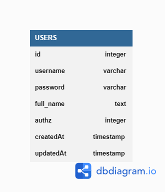

# Challenge Chapter 4 - Car Management Dasboard

This project is about implemetation of Database, Orm and Restful API.

## Entity Relationship Diagram (ERD)



## How To Run

1. Install Library

```bash
npm i
```

2. Create Database

```bash
npm run db:create
```

3. Migrating the model

```bash
npm run db:migrate
```

4. Running Project on development

```bash
nodemon index.js
```

## Users
- Akses Homepage/Get All data = http://localhost:3000/
- Akses Halaman Create mobil = http://localhost:3000/Cars/Create
- Akses Halaman Edit Mobil = http://localhost/Cars/:id

## API Endpoint
- Create data mobil baru = POST `http://localhost/Cars`
- Get semua data mobil = GET `http://localhost/`
- Get satu data mobil = GET `http://localhost/Cars/:id`
- Delete satu data mobil = DELETE `http://localhost/Cars/:id`
- Update satu data mobil = PUT `http://localhost/Cars/:id`
